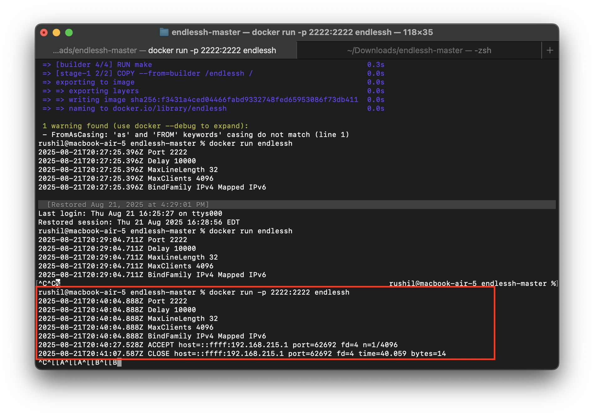
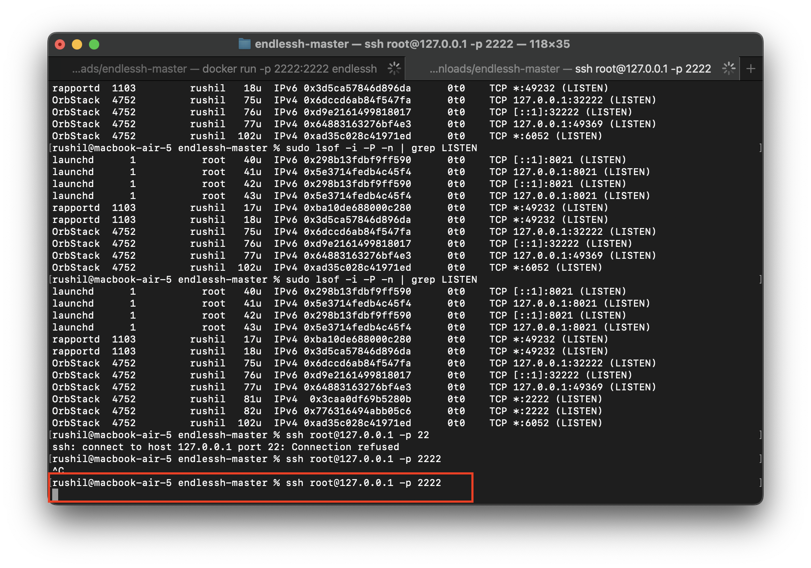
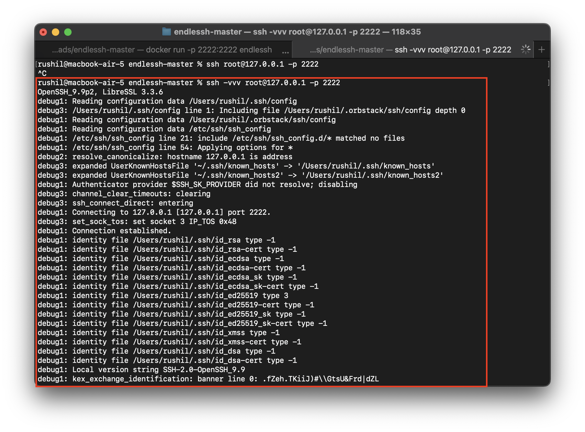
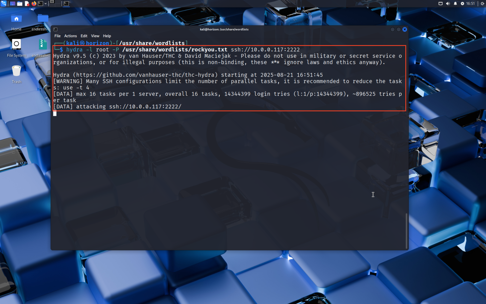

# 🕵️ SSH Honeypot

A lightweight SSH honeypot designed to capture and log unauthorized login attempts.  

---

## ⚠️ Disclaimer
This software is a **honeypot** and should **never** be deployed on production systems or networks without proper isolation.  
The authors are **not responsible** for any misuse or damage caused by this project.

Project built by https://github.com/skeeto/endlessh.
This is just an install walkthrough. All credits go to the original dev.

---

## Pictures


*Figure 1: Once the container is running, logs can be observed.*

*Figure 2: Trying ssh access to the container results in a stuck terminal.*

*Figure 3: SSH access with verbose mode shows, that the ssh client is greeted with long wait times for ssh banner thus delaying the bruteforce attack.*

*Figure 4: Using Hydra to attack the endless ssh container results in the same.*


---

## Getting Started

### 1. Clone the repository
```bash
git clone https://github.com/skeeto/endlessh
cd endlessh
```
### 2. Docker Build and run
```bash
docker build --no-cache -t endlessh .
docker run -p 2222:2222 endlessh
```
### 3. Try SSH login
```bash
ssh -vvv root@<ip> -p 2222
```
### 3. Try Hydra to bruteforce ssh
```bash
hydra -l root -P /usr/share/wordlists/rock_you.txt ssh://<ip>:2222
```
